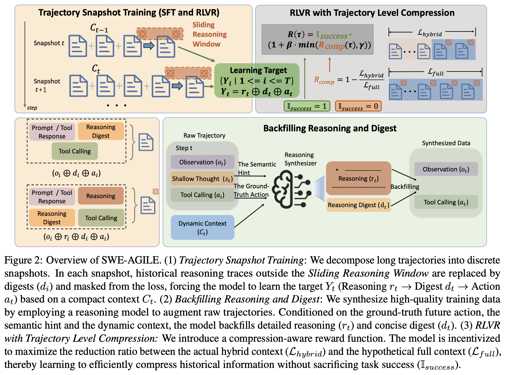
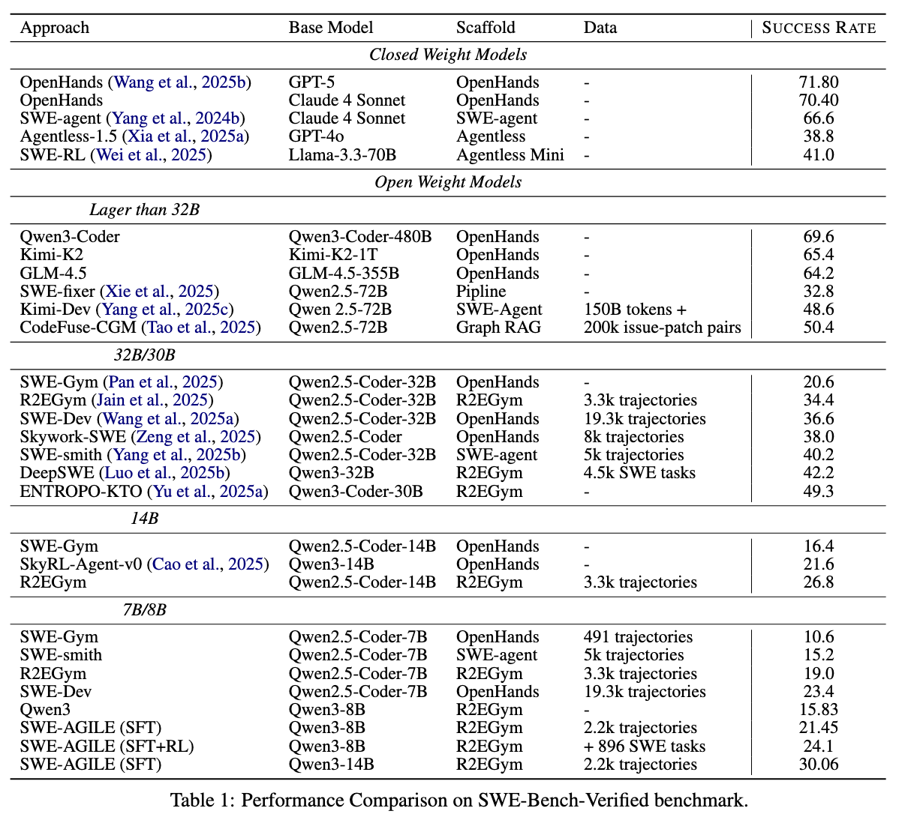

# SWE-AGILE


## 📣 News

[2026/02/23] SWE-AGILE has been accepted to the ACL 2026 Findings.


<font size=4><div align='center' > [[📖 Paper]()] [[🤗 Checkpoints](https://huggingface.co/KDEGroup/SWE-AGILE-RL-8B)] [[🤗 Data]()] [[🤗 Daily Paper]()] [[🚀 Github](https://github.com/KDEGroup/SWE-AGILE)]</div></font>

## 🔥 Overview

We propose SWE-AGILE, a novel software agent framework designed to bridge the gap between reasoning depth, efficiency, and context constraints. SWE-AGILE introduces a Dynamic Reasoning Context strategy, maintaining a “sliding window” of detailed reasoning for immediate continuity to prevent redundant re-analyzing, while compressing historical reasoning content into concise Reasoning Digests.


While our current paradigm implicitly reduces redundant state reconstruction, **a highly promising direction to strictly enforce this efficiency** is to quantitatively monitor the reasoning content. By \emph{calculating the embedding similarity between consecutive reasoning steps or employing an LLM-as-a-Judge}, future iterations can explicitly filter out repetitive SFT trajectories or design targeted RLVR penalties, pushing the boundary of cognitive efficiency even further.

  







In this repository, We implement the codebase We used for the SWE-AGILE paper, a software-agent framework for managing dynamic reasoning context with a sliding reasoning window.

At a high level, We organize the project into three parts:

- `R2E-Gym/` for task environments, datasets, and Docker-based execution.
- `rllm/` for agent execution, prompt parsing, SFT, RL, and evaluation.
- `data_process/` for offline trajectory processing, especially reasoning backfilling and training-data conversion.

## What We changed relative to upstream projects

### `R2E-Gym`

We built `R2E-Gym/` on top of the upstream repository [R2E-Gym/R2E-Gym](https://github.com/R2E-Gym/R2E-Gym).

The most important change is:

- `R2E-Gym/src/r2egym/agenthub/runtime/docker_.py`

This is the runtime implementation We actually use in the environment layer. 

🔥 We integrated [multi-swe-bench/multi-swe-bench](https://github.com/multi-swe-bench/multi-swe-bench) evaluationon into our pipeline and applied some design patterns to make the code more elegant.

The active wiring is in: `R2E-Gym/src/r2egym/agenthub/environment/env.py` where the environment imports: `from r2egym.agenthub.runtime.docker_ import DockerRuntime`

### `rllm`

We built `rllm/` on top of the upstream repository [rllm-org/rllm](https://github.com/rllm-org/rllm).

- `last_n_reasoning = (the size of the sliding reasoning window - 1) mentioned in the SWE-AGILE paper`

The core `last_n_reasoning` logic lives in:

- `rllm/rllm/engine/agent_execution_engine.py`
- `rllm/rllm/parser/chat_template_parser.py`
- `rllm/rllm/trainer/agent_sft_trainer.py`

More specifically:

- In `agent_execution_engine.py`, We propagate `last_n_reasoning` during rollout and evaluation, save it into the trajectory object, and measure the compressed trajectory length.
- In `chat_template_parser.py`, We only implement the sliding reasoning window behavior for `QwenChatTemplateParser`.
- In `agent_sft_trainer.py`, We modify the paper's Trajectory Snapshot Training SFT logic so that each training snapshot only keeps reasoning from the most recent window.


## Reproducing

The intended order in this repository is:

1. Prepare datasets and Docker images.
2. Backfill reasoning content from existing trajectories / Collect trajectories by running `run_deepswe.py`
3. Convert the backfilled trajectories into SFT-ready parquet files.
4. Run SFT and optionally RL.
5. Run final evaluation.


### 1. Prepare data and environments

Register datasets and pre-pull Docker images.

- `rllm/examples/swe/pre_post_scripts/prepare_swe_data.py`
- `rllm/examples/swe/pre_post_scripts/pre_pull_docker.py`

### 2. Backfill reasoning content

Use`data_process/fillback.py` as the core paper-specific offline script for backfilling.

The default input in the script is:`zai-org/SWE-Dev-train/SWE-Dev-train-trajectories_rft_2276.jsonl`

What this script do:

- Take existing assistant trajectories that do not yet have structured reasoning fields.
- Call an OpenAI-compatible API to reconstruct `<reasoning>...</reasoning>` and a short summary/digest-like block for each assistant step.
- Keep full reasoning only for the recent steps and keep compressed summaries for older steps.
- Sample and save `last_n_reasoning` for each trajectory so the later SFT stage can reproduce the same sliding-window behavior.

### 3. Convert fillbacked data into training parquet

 Run `data_process/to_training_data_verl.py` to convert the fillbacked trajectories into Verl-style training parquet.

In this step:

- Extract assistant reasoning into `message["reasoning"]`.
- Convert the retained visible summary into `<reasoning_digest>...</reasoning_digest>`.
- Normalize prompt and tool naming differences such as `str_replace_editor -> file_editor` and `workspace -> testbed`.
- Support both `step` and `trajectory` SFT modes.
- Can either pre-filter old reasoning during preprocessing or leave it to training time.

### 4. Run SFT

SFT logic is implemented primarily in: `rllm/rllm/trainer/agent_sft_trainer.py`

This is where we adapt trajectory snapshot training so that each snapshot only keeps reasoning from the latest reasoning window implied by `last_n_reasoning`.

Except for converted SWE-Dev data, data collected by running: `rllm/examples/swe/eval_and_sft/run_deepswe.py` can also be used to Rejection Sampling Fine-tuning.

### 5. Run RL

RL training entry is:

- `rllm/examples/swe/rl_qwen3_8B_dapo.sh`

### 6. Run final evaluation

Final evaluation entry is:

- `rllm/examples/swe/eval_and_sft/eval.sh`

We use `last_n_reasoning` in this script to represent different paper settings:

- Interleaved Thinking: keep nearly all historical reasoning by using a very large window.
- Current-Step Thinking: keep only the current-step reasoning by setting the effective historical window to zero.
- SWE-AGILE: keep a bounded recent reasoning window by setting a finite `last_n_reasoning`.

## `data_process/` scripts

### `data_process/filter_traj.py`

We use this script to filter trajectories by the number of assistant messages. It is useful for trimming very short or very long trajectories before training.


### `data_process/traj_statics.py`

We use this script to compute token-level trajectory statistics, including reasoning-token lengths and compressed trajectory lengths.


## Environment and dependency notes

Bootstrap the environment with:

- `init_env.sh`

The important versions and constraints are:

- `rllm==0.2.1`
- `verl==0.6.1`
- `torch==2.8.0`
- Python `3.11` virtual environment created by `uv`
- `sglang==0.5.5`
- a matching prebuilt `flash-attn` wheel for the selected Python and Torch versions

For the full environment snapshot, rely on:

- `constraints.txt`


## ⭐️ Citation

If you find this project useful, welcome to cite us.

\```bit


\```


In addition, you might be interested in our other projects: [KDEGroup/UI-AGILE](https://github.com/KDEGroup/UI-AGILE)

## 🤝 Acknowledgements

We sincerely thank projects [R2E-Gym/R2E-Gym](https://github.com/R2E-Gym/R2E-Gym),  [rllm-org/rllm](https://github.com/rllm-org/rllm) for providing their open-source resources.

